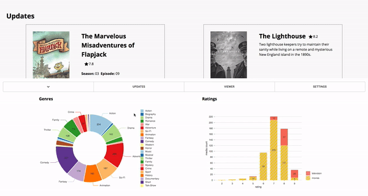

## Current Version

## Description
Custom media player designed to mimic real television from media stored in cloud services. The framework for this service is provided in this repository, but the endpoints that provide the specific media locations are absent due to copyright concerns. The website also has the ability to cast the media to external devices, making it convenient to use anywhere.

## Technology
* React w/ Redux+Saga+Material-UI+D3+Video
* Google Chromecast
* Google Functions 
* Google Storage

## License

This project is licensed under the MIT license, Copyright (c) 2019 Briar
Zimmerman. For more information see `LICENSE.md`.
